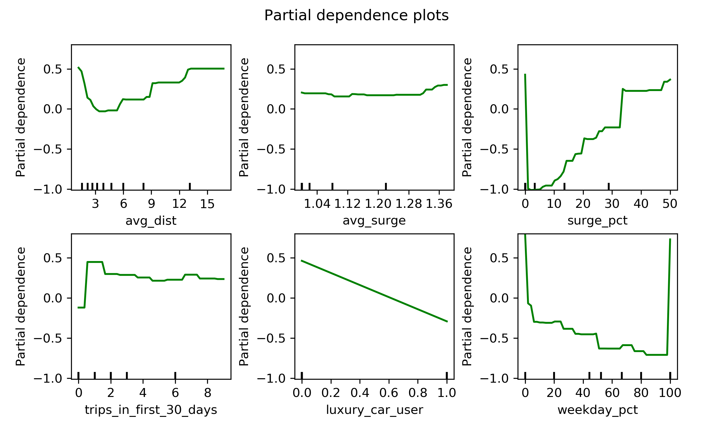
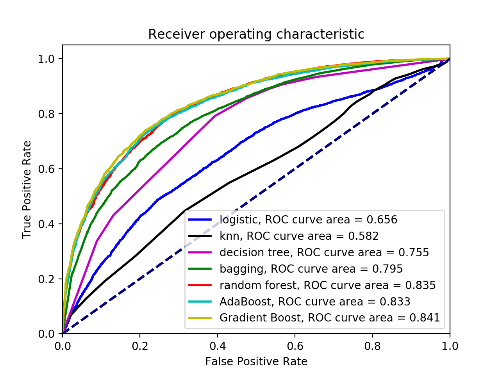

### approach
 - __company priority__: retain users, if we think they'll churn, give an incentive
 - __company action__: if p(churn) > 0.8 --> spend $10 on incentive
 - __cost/benefit__: incentive costs $10, c.l.v. valued at $100

cost-benefit matrix:

 |           |predicted0 | predicted1(churn) |
 |---------- |---------- |----------- |
 |__actual0__   |  0 |  -10|
 |__actual1(churn)__   |  0| 20 (-10 + 100*.2)|

 Assumes 20% retention rate with incentive

__precision__ is our target score metric:
 -  many people will churn, so we don't care about getting all of them, but of the people who will churn, we want to predict right so we don't waste incentive funds.

### picking the 'churn' target
pick by last active day
 -  June 1 (30 days ago): 62% of users have churned
 -  May 1 (60 days ago): 47% of users haves churned

### evaluating models

|        model | methods | accuracy | precision |
|---------- |---------- |----------- | ----------|
| logistic regression |  cross-val, cv=5 |  0.745| 0.734 |
| knn | 50 neighbors | 0.786 | 0.753 |
| decision tree  | simple tree | 0.712 | 0.720 |
| bagging | 100 trees | 0.735 | 0.782|
| random forest | grid searched | 0.769 | 0.789 |
| AdaBoost | defaults | 0.761 | 0.782 |
| gradient boost | defaults | 0.770 | 0.794 |
| SVM | kernel=linear, C=5 | 0.74 | 0.69 |
| SVM | kernal=rbf, C=1, gamma=0.1 | 0.607 | 0.575 |
| SVM | kernal=poly, defaults | 0.613 | 0.594 |

### Feature Importances for Logistic Regression
|features: |avg_dist|avg_surge|surge_pct|trips_in_first_30_days|gets_rated|
|--|--|--|--|--|--|
|Beta|0.193|0.0396| -0.0759|-0.404|-0.039|
|features:|luxury_car_user|weekday_pct|city_Astapor|city_King's Landing|
|Beta|-0.425|  0.016|0.306|-0.426|
|features|city_Winterfell|phone_Android|phone_iPhone|rate_driver|
|Beta|0.055|  0.157| -0.347|   -0.252|

### Feature Importances with Gradient Boost

### Feature Importance with Decision Tree

